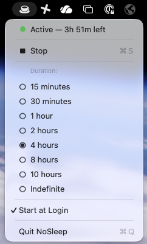

# NoSleep

A lightweight macOS menu bar utility that prevents your Mac from sleeping. Wraps the built-in `caffeinate` command into a simple, toggleable status bar app.

No Dock icon. No main window. Just a cup icon in your menu bar.

<p align="center">
  
</p>

## Installation

### Option 1 — Download the DMG (recommended)

1. Download `NoSleep-<version>.dmg` from the [Releases](../../releases) page.
2. Open the DMG and drag **NoSleep** onto the **Applications** folder.
3. **First launch only** — NoSleep is ad-hoc signed (not notarized by Apple), so macOS
   Gatekeeper blocks it until you approve it once. Either:
   - Clear the download quarantine in Terminal:
     ```bash
     xattr -dr com.apple.quarantine /Applications/NoSleep.app
     ```
   - **or** try to open it, then go to **System Settings → Privacy & Security** and click
     **Open Anyway**.

Launch NoSleep from Applications — a cup icon (☕) appears in your menu bar.

### Option 2 — Build from source

Requires macOS 14+, Xcode Command Line Tools (`xcode-select --install`), and Swift 6+.

```bash
./build.sh              # compile universal binary, bundle, ad-hoc sign → NoSleep.app
open NoSleep.app        # run it — cup icon appears in the menu bar
./install.sh            # optional: copy to ~/Applications
```

See [Build](#build), [Run](#run), and [Install to ~/Applications](#install-to-applications-optional) below for details.

## Features

- **One-click toggle** — start/stop caffeinate from the menu bar
- **Duration presets** — 15 min, 30 min, 1 hr, 2 hr, 4 hr, 10 hr, or Indefinite
- **Live countdown** — shows remaining time while active
- **Start at Login** — optional LaunchAgent for auto-start
- **Prevents display + idle sleep** — uses `caffeinate -d -i`

## Requirements

- macOS 14 (Sonoma) or later
- Xcode Command Line Tools (`xcode-select --install`)
- Swift 6.0+

## Build

```bash
./build.sh
```

This will:
1. Compile the project with `swift build -c release`
2. Create `NoSleep.app` bundle with `Info.plist`
3. Ad-hoc code sign the app

## Run

```bash
open NoSleep.app
```

A cup icon (☕) appears in your menu bar. Click it to see the menu:

- **Start/Stop** — toggle caffeinate on or off
- **Duration** — pick how long to keep your Mac awake
- **Start at Login** — enable to launch NoSleep automatically on boot
- **Quit** — stop caffeinate and exit the app

The icon changes to a filled cup when active.

## Install to ~/Applications (optional)

```bash
./install.sh
```

Copies `NoSleep.app` to `~/Applications/` and updates the LaunchAgent path if Start at Login is enabled.

## Package a DMG (for releases)

```bash
./make-icons.sh      # only when the icon/background art changes — generates assets/AppIcon.icns
./build.sh           # builds the universal (Apple Silicon + Intel) NoSleep.app
./package-dmg.sh     # produces NoSleep-<version>.dmg
```

`package-dmg.sh` builds a styled disk image (app on the left, an arrow to the
**Applications** drop-target, custom background and volume icon). The version in the DMG
name is read from the app's `Info.plist`. macOS may prompt to let your terminal control
Finder the first time — this is required for the DMG window layout.

## Uninstall

```bash
# Remove the app
rm -rf ~/Applications/NoSleep.app

# Remove the LaunchAgent (if enabled)
rm -f ~/Library/LaunchAgents/com.nosleep.app.plist

# Remove saved preferences
defaults delete com.nosleep.app 2>/dev/null
```

## Project Structure

```
nosleep/
├── Package.swift                  # SPM config (macOS 14+, SwiftUI)
├── Sources/
│   └── NoSleep/
│       ├── NoSleepApp.swift       # App entry point, MenuBarExtra
│       ├── MenuBarView.swift      # Dropdown menu UI
│       ├── CaffeinateManager.swift # caffeinate process + countdown
│       └── LoginItemManager.swift  # LaunchAgent plist management
├── scripts/
│   └── generate-art.swift         # AppKit renderer for icon + DMG background
├── assets/
│   ├── AppIcon.icns               # App icon (generated)
│   ├── AppIcon.png                # 1024px icon master (generated)
│   └── dmg-background*.png        # DMG window background (generated)
├── build.sh                       # Build universal binary + bundle + code sign
├── make-icons.sh                  # Regenerate icon/background art
├── package-dmg.sh                 # Build styled NoSleep-<version>.dmg
├── install.sh                     # Install to ~/Applications
└── README.md
```

## How It Works

NoSleep spawns `/usr/bin/caffeinate` as a child process with flags:
- `-d` — prevent the display from sleeping
- `-i` — prevent the system from idle sleeping
- `-t <seconds>` — auto-stop after the selected duration (omitted for Indefinite)

When you quit NoSleep or click Stop, the caffeinate process is terminated. If caffeinate's timer expires naturally, the app detects this and updates its state.

## License

NoSleep is free software: you can redistribute it and/or modify it under the terms of the GNU General Public License as published by the Free Software Foundation, either version 3 of the License, or (at your option) any later version.

This program is distributed in the hope that it will be useful, but WITHOUT ANY WARRANTY; without even the implied warranty of MERCHANTABILITY or FITNESS FOR A PARTICULAR PURPOSE. See the [GNU General Public License](https://www.gnu.org/licenses/gpl-3.0.en.html) for more details.

See the [LICENSE](LICENSE) file for the full license text.