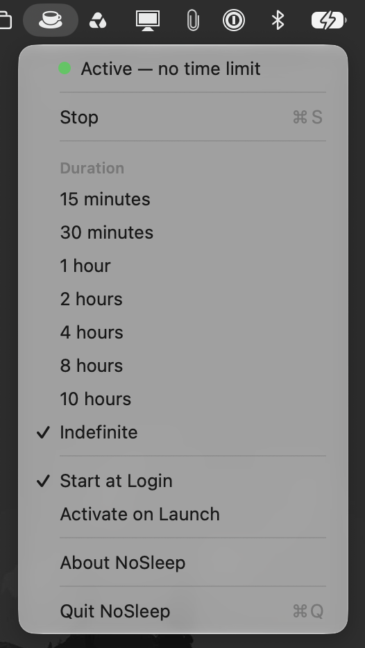

# NoSleep

A lightweight macOS menu bar utility that keeps your Mac from going to sleep due to inactivity (idle sleep). Wraps the built-in `caffeinate` command into a simple, toggleable status bar app.

No Dock icon. No main window. Just a cup icon in your menu bar.

```bash
brew install --cask sergio-farfan/tap/nosleep
```

<p align="center">
  
</p>

## Installation

### Option 1 — Homebrew (recommended)

```bash
brew install --cask sergio-farfan/tap/nosleep
```

Homebrew ≥ 6 asks you to trust the tap the first time (`brew trust sergio-farfan/tap`).
NoSleep is ad-hoc signed (not notarized), so macOS blocks the first launch: allow it once under
**System Settings → Privacy & Security → Open Anyway**, or clear the quarantine flag:

```bash
xattr -dr com.apple.quarantine /Applications/NoSleep.app
```

Expect that prompt again after every `brew upgrade`: ad-hoc builds get a new code identity each
release, so macOS cannot carry the approval over until releases are notarized. Update with
`brew upgrade --cask nosleep`; remove with `brew uninstall --cask --zap nosleep` (`--zap` also
deletes the saved preferences).

### Option 2 — Download the DMG

1. Download `NoSleep-<version>.dmg` from the [Releases](../../releases) page.
2. Open the DMG and drag **NoSleep** onto the **Applications** folder.
3. **First launch only** — NoSleep is ad-hoc signed (not notarized by Apple), so macOS
   Gatekeeper blocks it until you approve it once. Either:
   - Clear the download quarantine in Terminal:
     ```bash
     xattr -dr com.apple.quarantine /Applications/NoSleep.app
     ```
   - **or** try to open it, then go to **System Settings → Privacy & Security** and click
     **Open Anyway**.

Launch NoSleep from Applications — a cup icon (☕) appears in your menu bar.

### Option 3 — Build from source

Requires macOS 14+, Xcode Command Line Tools (`xcode-select --install`), and Swift 6+. Running `swift test` needs full Xcode: the Command Line Tools alone ship no XCTest.

```bash
./build.sh              # compile universal binary, bundle, ad-hoc sign → NoSleep.app
open NoSleep.app        # run it — cup icon appears in the menu bar
./install.sh            # optional: copy to ~/Applications
```

See [Build](#build), [Run](#run), and [Install to ~/Applications](#install-to-applications-optional) below for details. A source build installed with `install.sh` and a Homebrew install are the same app at two paths; keep one — the single-instance lock quits whichever launches second.

## Features

- **One-click toggle** — start/stop caffeinate from the menu bar
- **Auto-activate** — picking a duration starts immediately; re-picking while active restarts with the new duration
- **Duration presets** — 15 min, 30 min, 1 hr, 2 hr, 4 hr, 8 hr, 10 hr, or Indefinite
- **Live countdown** — a green dot and the remaining time in the menu while active (e.g. `2h 34m`)
- **Completion notification** — when a timed session ends, a notification offers **Extend 1 hour**; the menu also shows when the last session ended
- **Start at Login** — registers NoSleep as a login item (System Settings › General › Login Items)
- **Activate on Launch** — optional: start the saved duration as soon as NoSleep launches
- **Prevents idle display + idle system sleep** — uses `caffeinate -d -i` (see [Limitations](#limitations))

## Requirements

- macOS 14 (Sonoma) or later
- Xcode Command Line Tools (`xcode-select --install`) — full Xcode for `swift test`
- Swift 6.0+

## Build

```bash
./build.sh
```

This will:
1. Compile the project with `swift build -c release`
2. Create `NoSleep.app` bundle with `Info.plist`
3. Ad-hoc code sign the app

## Run

```bash
open NoSleep.app
```

A cup icon (☕) appears in your menu bar. Click it to see the menu:

- **Status line** — `Inactive`, `Active — 2h 34m left`, or, after a timed session ran out, when it ended; clicking it toggles start/stop
- **Start/Stop** — toggle caffeinate on or off
- **Duration** — pick a preset; NoSleep starts (or restarts) immediately with it
- **Start at Login** — launch NoSleep automatically when you log in. macOS shows a one-time “Background Items Added” notice; the item lives under **System Settings › General › Login Items**, where you can also switch it off
- **Activate on Launch** — also start a session with the saved duration on every launch (useful together with Start at Login)
- **About NoSleep** — shows the installed version
- **Quit** — stop caffeinate and exit the app

The icon changes to a filled cup when active. When a timed session ends, a notification offers **Extend 1 hour**, which runs a fresh one-hour session without changing your saved duration.

Only one copy of NoSleep runs at a time: launching a second copy (for example from the build directory while the installed one is running) exits immediately, and a lock-aware build quits a still-running pre-lock copy (1.1.0, or the 1.2.0 DMG published before 2026-09-12) when it starts.

### Notifications

When a timed session ends, NoSleep posts a notification with an **Extend 1 hour** button. macOS shows notification buttons only when you hover the notification; with the *Banners* style it also disappears after a few seconds, and the button may sit under **Options**. New installs default to the persistent *Alerts* style, which stays on screen until you act. If you installed an earlier version, set **System Settings › Notifications › NoSleep › Alert style** to **Alerts** to get the same behaviour. If notifications are off, the menu shows an item that opens that pane.

## Install to ~/Applications (optional)

```bash
./install.sh
```

Quits any running copy, installs `NoSleep.app` into `~/Applications/`, and relaunches it if it was running. If a LaunchAgent plist from NoSleep ≤ 1.1.0 is present its path is updated too; the app migrates it to a login item on first launch.

## Package a DMG (for releases)

```bash
./make-icons.sh      # only when the icon/background art changes — generates assets/AppIcon.icns
./build.sh           # builds the universal (Apple Silicon + Intel) NoSleep.app
./package-dmg.sh     # produces NoSleep-<version>.dmg and NoSleep-<version>.dmg.sha256
```

`package-dmg.sh` builds a styled disk image (app on the left, an arrow to the
**Applications** drop-target, custom background and volume icon). The version in the DMG
name is read from the app's `Info.plist`. macOS may prompt to let your terminal control
Finder the first time — this is required for the DMG window layout.

## Releasing

1. Set `VERSION` in `build.sh` and commit.
2. Tag and push: `git tag -a vX.Y.Z -m "NoSleep X.Y.Z" && git push origin vX.Y.Z`.
3. The [Release workflow](.github/workflows/release.yml) tests, builds, packages, verifies, and
   publishes the GitHub Release with `NoSleep-X.Y.Z.dmg` and its `.sha256`. Edit the generated
   notes afterwards if you want more than the commit list.
4. Homebrew cask. With the `TAP_DISPATCH_TOKEN` secret configured in this repository (a
   fine-grained PAT for `sergio-farfan/homebrew-tap` with *Contents: Read and write*), the
   workflow dispatches a bump to the tap automatically. Otherwise bump by hand:

   ```bash
   cd ~/projects/git/homebrew-tap
   NEW=X.Y.Z
   SHA=$(curl -sL "https://github.com/sergio-farfan/nosleep/releases/download/v${NEW}/NoSleep-${NEW}.dmg.sha256" | cut -d' ' -f1)
   sed -i '' -e "s/^  version \".*\"/  version \"${NEW}\"/" -e "s/^  sha256 \".*\"/  sha256 \"${SHA}\"/" Casks/nosleep.rb
   git commit -am "nosleep ${NEW}" && git push
   brew update && brew fetch --cask sergio-farfan/tap/nosleep   # confirm URL + hash resolve
   ```

   Users then get the new version with `brew update && brew upgrade --cask nosleep`.
   `brew livecheck --cask sergio-farfan/tap/nosleep` shows whether the cask lags the latest release.

## Uninstall

**Homebrew install:** `brew uninstall --cask nosleep` quits the app and removes it and its Start at
Login item; add `--zap` to also delete the preferences and the single-instance lock.

**DMG or source install:**

1. Turn off **Start at Login** first — in the NoSleep menu, or under
   **System Settings › General › Login Items**. The login item is tied to the app
   bundle, so removing the app first leaves a dangling entry there.
2. Quit NoSleep, then:

```bash
# Remove the app (DMG installs live in /Applications, install.sh uses ~/Applications)
rm -rf /Applications/NoSleep.app ~/Applications/NoSleep.app

# Remove a LaunchAgent left over from NoSleep ≤ 1.1.0, if any
rm -f ~/Library/LaunchAgents/com.nosleep.app.plist

# Remove saved preferences
defaults delete com.nosleep.app 2>/dev/null

# Remove the single-instance lock
rm -rf ~/Library/Application\ Support/NoSleep
```

## Project Structure

```
nosleep/
├── Package.swift                  # SPM config (macOS 14+, SwiftUI)
├── Sources/
│   └── NoSleep/
│       ├── NoSleepApp.swift       # App entry point, MenuBarExtra, single-instance lock
│       ├── MenuBarView.swift      # Dropdown menu UI, About alert
│       ├── CaffeinateManager.swift # caffeinate process, countdown, session state
│       ├── LoginItemManager.swift  # Start at Login via SMAppService
│       └── NotificationManager.swift # Session-ended notification + Extend action
├── Tests/
│   └── NoSleepTests/              # XCTest suite (state machine via fakes, launcher, login item, lock)
├── scripts/
│   └── generate-art.swift         # AppKit renderer for icon + DMG background
├── assets/
│   ├── AppIcon.icns               # App icon (generated)
│   ├── AppIcon.png                # 1024px icon master (generated)
│   ├── dmg-background*.png        # DMG window background (generated)
│   └── screenshot1.png            # README screenshot
├── docs/
│   ├── investigations/            # Bug investigations (e.g. the 2026-09-22 overheating report)
│   ├── reviews/                   # Code review reports
│   └── superpowers/               # Design spec + implementation plan (v1.1.0)
├── .github/workflows/
│   ├── ci.yml                     # Build, test, bundle, package and lint on pushes to main and PRs
│   └── release.yml                # Tag push → GitHub Release (DMG + .sha256) → Homebrew tap bump
├── build.sh                       # Build universal binary + bundle + code sign
├── make-icons.sh                  # Regenerate icon/background art
├── package-dmg.sh                 # Build styled NoSleep-<version>.dmg
├── install.sh                     # Install to ~/Applications
├── dev-to-article.md              # Source of the dev.to article
├── LICENSE                        # GPLv3
└── README.md
```

## How It Works

NoSleep spawns `/usr/bin/caffeinate` as a child process with flags:
- `-d` — prevent the display from sleeping
- `-i` — prevent the system from idle sleeping
- `-t <seconds>` — auto-stop after the selected duration (omitted for Indefinite)
- `-w <NoSleep pid>` — caffeinate exits on its own if NoSleep exits for any reason (crash, Force Quit, `kill`), so it is never left running without the app

When you quit NoSleep or click Stop, the caffeinate process is terminated. If caffeinate's timer expires naturally, the app detects this, updates its state, and posts a notification with an **Extend 1 hour** action.

Because the work is done by `caffeinate`, macOS attributes the sleep block to it: `pmset -g assertions` lists `caffeinate`, not NoSleep. To find the child NoSleep owns: `for p in $(pgrep -x NoSleep); do pgrep -P "$p" -x caffeinate; done` (tolerates NoSleep not running).

## Limitations

- **Only idle sleep is prevented.** Closing a MacBook's lid, choosing Apple menu › Sleep, pressing the power button, scheduled sleep and low-battery sleep still put the Mac to sleep while NoSleep is active. That is macOS policy for the `-d -i` assertions, not something NoSleep can override. To keep a closed MacBook running, use clamshell mode (external display, power, and a keyboard or mouse).
- **Time spent asleep does not count.** Both caffeinate's timer and the countdown run on the system uptime clock, which pauses while the Mac sleeps: a 4-hour session interrupted by an hour of sleep ends five hours after it started. The countdown resynchronises on wake.
- **The screen stays on.** `-d` also keeps the display awake, which holds off the idle screen saver and screen lock for the whole session. On battery, pick a short preset or lower the brightness.

## License

NoSleep is free software: you can redistribute it and/or modify it under the terms of the GNU General Public License as published by the Free Software Foundation, either version 3 of the License, or (at your option) any later version.

This program is distributed in the hope that it will be useful, but WITHOUT ANY WARRANTY; without even the implied warranty of MERCHANTABILITY or FITNESS FOR A PARTICULAR PURPOSE. See the [GNU General Public License](https://www.gnu.org/licenses/gpl-3.0.en.html) for more details.

See the [LICENSE](LICENSE) file for the full license text.